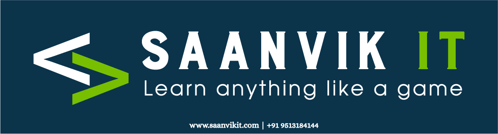

<div align="center">
  
  <h1>Azure Interview Questions and Answers</h1>
  <p><em>A comprehensive guide to prepare for Azure technical interviews</em></p>
  <hr>
</div>

## Table of Contents
- [Cloud Computing Fundamentals](#cloud-computing-fundamentals) (Questions 1-20)
- [Virtual Machine and Storage](#virtual-machine-and-storage) (Questions 21-40)
- [Storage and Networking](#storage-and-networking) (Questions 41-60)
- [Networking](#networking) (Questions 61-100)
- [Azure Active Directory](#azure-active-directory) (Questions 101-120)
- [Load Balancing and Traffic Management](#load-balancing-and-traffic-management) (Questions 121-131)
- [Migration and Disaster Recovery](#migration-and-disaster-recovery) (Questions 132-140)

<hr>

## Cloud Computing Fundamentals

### 1. What is cloud computing? 🌐
<div class="answer">
<p>Cloud computing is a technology model that delivers computing services over the internet ("the cloud"), including servers, storage, databases, networking, software, analytics, and intelligence. It offers faster innovation, flexible resources, and economies of scale by eliminating the need to own and maintain physical infrastructure.</p>
</div>

### 2. What are the Cloud computing service models? ☁️
- **IaaS (Infrastructure as a Service)**: Provides virtualized computing resources over the internet (e.g., Azure VMs, Storage)
- **PaaS (Platform as a Service)**: Provides a platform allowing customers to develop, run, and manage applications without dealing with infrastructure (e.g., Azure App Service, Azure Functions)
- **SaaS (Software as a Service)**: Delivers software applications over the internet on a subscription basis (e.g., Microsoft 365, Dynamics 365)

### 3. Cloud deployment models
- **Public Cloud**: Services offered over the public internet and available to anyone who wants to purchase them
- **Private Cloud**: Cloud infrastructure operated solely for a single organization
- **Hybrid Cloud**: Combination of public and private clouds with orchestration between the two
- **Multi-Cloud**: Using cloud services from multiple cloud providers
- **Community Cloud**: Infrastructure shared by several organizations with common concerns

### 4. Difference between ASM vs ARM deployment model
- **ASM (Azure Service Management)**: The classic/legacy deployment model where resources were managed individually
- **ARM (Azure Resource Manager)**: The current deployment model that enables you to work with resources as a group, provides better security, tagging, and template-based deployments

### 5. What is ARM?
Azure Resource Manager (ARM) is the deployment and management service for Azure. It provides a management layer that enables you to create, update, and delete resources in your Azure subscription. ARM allows you to deploy, manage, and monitor all the resources for your solution as a group, rather than handling these resources individually.

### 6. What is a resource group?
A resource group is a container that holds related resources for an Azure solution. The resource group includes those resources that you want to manage as a group. You decide which resources belong in a resource group based on what makes the most sense for your organization.

### 7. What is Azure RBAC?
Azure Role-Based Access Control (RBAC) is an authorization system built on Azure Resource Manager that provides fine-grained access management of Azure resources. It allows you to grant users only the amount of access they need to perform their jobs, following the principle of least privilege.

### 8. What is Azure policy and how to implement it?
Azure Policy is a service in Azure that you use to create, assign, and manage policies. These policies enforce different rules and effects over your resources, so those resources stay compliant with your corporate standards and service level agreements.

Implementation steps:
1. Define your policy using JSON format or use built-in policy definitions
2. Create a policy assignment (scope can be management group, subscription, or resource group)
3. Review compliance data and remediate non-compliant resources

### 9. What are Azure resource locks?
Azure resource locks prevent accidental deletion or modification of your Azure resources. There are two types of locks:
- **CanNotDelete**: Authorized users can read and modify a resource, but they can't delete it
- **ReadOnly**: Authorized users can read a resource, but they can't delete or update it

### 10. Azure PowerShell command to login to portal
```powershell
Connect-AzAccount
```

### 11. Azure PowerShell command to create a resource group and VM
```powershell
# Create a resource group
New-AzResourceGroup -Name "MyResourceGroup" -Location "East US"

# Create a VM
New-AzVM -ResourceGroupName "MyResourceGroup" -Name "MyVM" -Location "East US" -VirtualNetworkName "MyVNet" -SubnetName "Default" -SecurityGroupName "MyNSG" -PublicIpAddressName "MyPublicIP" -OpenPorts 80,3389
```

### 12. CLI command to login to portal
```bash
az login
```

### 13. What are Azure tags?
Azure tags are name-value pairs that you can apply to Azure resources for logical organization. Tags allow you to categorize resources by purpose, environment, department, cost center, lifecycle, etc. Tags are especially useful for resource management, cost tracking, and automation.

### 14. How many ways we can create resources on Azure portal?
Resources in Azure can be created through multiple methods:
1. Azure Portal (GUI)
2. Azure PowerShell
3. Azure CLI
4. Azure Resource Manager (ARM) templates
5. Azure REST API
6. Azure SDKs (for various programming languages)
7. Terraform and other third-party IaC tools
8. Azure Cloud Shell

### 15. What are the prerequisites to create Azure VM?
Prerequisites for creating an Azure VM include:
- An Azure subscription
- A resource group
- A virtual network and subnet
- A public IP address (if you need internet access)
- A network security group
- A storage account (for diagnostics and boot diagnostics)
- Selection of VM size, region, and operating system
- Authentication method (password or SSH key for Linux)

### 16. How many types of VMs we have in Azure?
Azure offers several VM series optimized for different purposes:
- General purpose (B, D, A series)
- Compute optimized (F series)
- Memory optimized (E, M series)
- Storage optimized (L series)
- GPU (N series)
- High performance compute (H series)
- Confidential computing (DC series)

### 17. How to change Azure VM size?
To resize an Azure VM:
1. Stop (deallocate) the VM
2. In the Azure Portal, go to the VM settings
3. Select "Size" from the menu
4. Choose a new size from the available options
5. Click "Resize"
6. Restart the VM

Using PowerShell:
```powershell
Stop-AzVM -ResourceGroupName "MyResourceGroup" -Name "MyVM" -Force
$vm = Get-AzVM -ResourceGroupName "MyResourceGroup" -Name "MyVM"
$vm.HardwareProfile.VmSize = "Standard_DS2_v2"
Update-AzVM -ResourceGroupName "MyResourceGroup" -VM $vm
Start-AzVM -ResourceGroupName "MyResourceGroup" -Name "MyVM"
```

### 18. What is the difference between managed disk and unmanaged disk?
**Managed Disks**:
- Azure handles storage account creation and management
- Simplifies disk management for VMs
- Better reliability with automatic placement in different storage fault domains
- Supports availability sets and zones
- Supports disk encryption, snapshots, and backups

**Unmanaged Disks**:
- You must create and manage the storage accounts
- Limited to 20,000 IOPS per storage account
- All VHDs in the same storage account share the IOPS limit
- Requires more management overhead
- Not recommended for new deployments

### 19. What is meant by availability set and availability zone?
**Availability Set**:
- Logical grouping of VMs within a single datacenter
- Protects against hardware failures and planned maintenance
- Uses fault domains (different racks) and update domains (maintenance groups)
- Provides 99.95% SLA when two or more VMs are deployed

**Availability Zone**:
- Physically separate zones within an Azure region
- Each zone has independent power, cooling, and networking
- Protects against entire datacenter failures
- Provides 99.99% SLA when VMs are replicated across zones
- Not available in all Azure regions

### 20. What is meant by Azure spot instance?
Azure Spot Instances (formerly Low-priority VMs) are unused Azure compute capacity available at significant discounts compared to standard VMs. Key characteristics:
- Up to 90% cost savings compared to pay-as-you-go prices
- Can be evicted at any time when Azure needs the capacity back
- Ideal for interruptible workloads, batch processing, dev/test environments
- Not suitable for production or critical workloads
- No SLA is provided
## Virtual Machine and Storage

### 21. What are all the OS disk types we have while creating VM and explain the use cases?
Azure offers several disk types for OS disks:
- **Ultra Disk**: Highest performance with sub-millisecond latency (for mission-critical workloads)
- **Premium SSD**: High-performance SSD storage (for production workloads)
- **Standard SSD**: Balanced performance and cost (for dev/test environments)
- **Standard HDD**: Cost-effective storage (for non-critical workloads)

### 22. How do you troubleshoot RDP issues?
Common RDP troubleshooting steps:
1. Verify the VM is running
2. Check NSG rules to ensure port 3389 is open
3. Verify network connectivity (ping, telnet)
4. Reset RDP configuration using Azure portal
5. Check Windows Firewall settings
6. Verify RDP service is running on the VM
7. Check for Windows updates causing issues
8. Review VM boot diagnostics logs

### 23. When you reset VM password what is the extension it uses?
- For Windows VMs: VMAccessAgent extension
- For Linux VMs: VMAccessForLinux extension

### 24. What is Azure Bastion?
Azure Bastion is a fully managed PaaS service that provides secure and seamless RDP/SSH connectivity to your VMs directly from the Azure portal over TLS. It eliminates the need to expose VMs with public IP addresses, reducing the attack surface.

### 25. How to increase the OS disk size of VM?
1. In Azure Portal: Navigate to VM > Disks > OS disk > Size + performance > Change size
2. Using PowerShell:
```powershell
$vm = Get-AzVM -ResourceGroupName "MyResourceGroup" -Name "MyVM"
$vm.StorageProfile.OSDisk.DiskSizeGB = 128
Update-AzVM -ResourceGroupName "MyResourceGroup" -VM $vm
```
3. After resizing, you need to extend the volume within the OS

### 26. How to attach data disk?
1. In Azure Portal: Navigate to VM > Disks > Add data disk > Create disk or select existing
2. Using PowerShell:
```powershell
$vm = Get-AzVM -ResourceGroupName "MyResourceGroup" -Name "MyVM"
$vm = Add-AzVMDataDisk -VM $vm -Name "MyDataDisk" -CreateOption Empty -DiskSizeInGB 128 -Lun 0
Update-AzVM -ResourceGroupName "MyResourceGroup" -VM $vm
```

### 27. What is the command to connect Linux VM?
```bash
ssh username@public_ip_address
```

### 28. What are the port numbers for RDP, SSH, HTTP, and HTTPS?
- RDP: 3389
- SSH: 22
- HTTP: 80
- HTTPS: 443

### 29. How to mount data disk to Linux VM?
1. Connect to the VM using SSH
2. Identify the disk using `lsblk` or `fdisk -l`
3. Create a partition using `fdisk /dev/sdX`
4. Format the partition: `mkfs -t ext4 /dev/sdX1`
5. Create a mount point: `mkdir /mnt/data`
6. Mount the disk: `mount /dev/sdX1 /mnt/data`
7. For persistent mounting, add to `/etc/fstab`: `/dev/sdX1 /mnt/data ext4 defaults 0 0`

### 30. Tell me some Linux commands which you have used?
- `ls`: List directory contents
- `cd`: Change directory
- `mkdir`: Create directory
- `rm`: Remove files or directories
- `cp`: Copy files or directories
- `mv`: Move or rename files
- `chmod`: Change file permissions
- `chown`: Change file ownership
- `grep`: Search text patterns
- `find`: Search for files
- `df`: Display disk space usage
- `top`: Display system processes
- `systemctl`: Control system services
- `apt/yum`: Package management

### 31. How do you take a backup of a VM?
1. Navigate to the VM in Azure Portal
2. Select "Backup" from the menu
3. Create or select a Recovery Services vault
4. Define backup policy (schedule, retention)
5. Enable backup

### 32. What is Recovery Service Vault?
Recovery Services vault is an Azure storage entity that stores backup data for various Azure services. It contains backup copies, recovery points, and backup policies. It provides features like cross-region restore, soft delete, and backup reports.

### 33. In which format are your backup items stored?
Azure VM backups are stored as recovery points in the Recovery Services vault. The data is stored in a proprietary format optimized for efficient storage and recovery, not as standard VHD files.

### 34. What are the backup types?
- **Full backup**: Complete copy of all data
- **Incremental backup**: Only changes since the last backup
- **Differential backup**: Changes since the last full backup
- **Application-consistent backup**: Includes application data in a consistent state
- **File-system consistent backup**: Ensures file system integrity

### 35. How do you restore VM backup?
1. Navigate to Recovery Services vault
2. Select "Backup items" > "Azure Virtual Machine"
3. Select the VM to restore
4. Choose "Restore VM" and select a recovery point
5. Choose restore options (Create new VM, Replace existing, Restore disks)
6. Specify target resource group, storage account, and network settings
7. Initiate restore operation

### 36. How do you take the on-prem server files and folders backup?
Using Azure Backup agent (MARS - Microsoft Azure Recovery Services):
1. Create a Recovery Services vault in Azure
2. Download and install the MARS agent on the on-premises server
3. Register the server with the vault
4. Configure backup policy (items to back up, schedule, retention)
5. Run initial backup

### 37. How do you troubleshoot if the backup jobs fail?
1. Check the backup job status and error details in Azure Portal
2. Verify network connectivity between the VM and Azure Backup service
3. Check for VM extensions issues
4. Verify storage account accessibility
5. Check for disk space issues
6. Review Azure Backup agent logs
7. Verify VM is running and healthy
8. Check for any conflicting operations on the VM

### 38-39. Have you written any PowerShell script to take VM backup? Create a PowerShell script to take VM backup.
```powershell
# PowerShell script to take VM backup
param(
    [Parameter(Mandatory=$true)]
    [string]$ResourceGroupName,
    
    [Parameter(Mandatory=$true)]
    [string]$VMName,
    
    [Parameter(Mandatory=$true)]
    [string]$VaultName,
    
    [Parameter(Mandatory=$true)]
    [string]$VaultResourceGroup,
    
    [Parameter(Mandatory=$true)]
    [string]$PolicyName
)

# Connect to Azure account
Connect-AzAccount

# Get the VM
$vm = Get-AzVM -ResourceGroupName $ResourceGroupName -Name $VMName

# Get the Recovery Services Vault
$vault = Get-AzRecoveryServicesVault -ResourceGroupName $VaultResourceGroup -Name $VaultName

# Set vault context
Set-AzRecoveryServicesVaultContext -Vault $vault

# Get backup policy
$policy = Get-AzRecoveryServicesBackupProtectionPolicy -Name $PolicyName

# Enable backup for the VM
Enable-AzRecoveryServicesBackupProtection -ResourceGroupName $ResourceGroupName -Name $VMName -Policy $policy

# Trigger backup job
$backupContainer = Get-AzRecoveryServicesBackupContainer -ContainerType AzureVM -Status Registered -FriendlyName $VMName
$item = Get-AzRecoveryServicesBackupItem -Container $backupContainer -WorkloadType AzureVM
$job = Backup-AzRecoveryServicesBackupItem -Item $item

# Return job details
Write-Output "Backup job started with ID: $($job.JobId)"
Write-Output "Check job status with: Get-AzRecoveryServicesBackupJob -JobId $($job.JobId)"
```

### 40. What is the min CIDR required to enable bastion?
Azure Bastion requires a subnet named "AzureBastionSubnet" with a minimum size of /27 CIDR (32 addresses).
## Storage and Networking

### 41. What are the storage account types?
Azure offers several storage account types:
- **Standard general-purpose v2**: For most storage scenarios (blobs, files, queues, tables)
- **Premium block blobs**: For high-transaction rate scenarios or storing smaller objects
- **Premium file shares**: For enterprise file share applications
- **Premium page blobs**: For IaaS disks and high-performance scenarios

### 42. What are all the storage service types?
- **Blob Storage**: For unstructured data like documents, images, videos
- **File Storage**: Managed file shares accessible via SMB protocol
- **Queue Storage**: For message queuing and reliable messaging
- **Table Storage**: NoSQL key-attribute store for structured data
- **Disk Storage**: Block-level storage volumes for Azure VMs

### 43. What are all the storage replication types?
- **LRS (Locally Redundant Storage)**: Three copies within a single facility in one region
- **ZRS (Zone-Redundant Storage)**: Three copies across multiple facilities in one region
- **GRS (Geo-Redundant Storage)**: Six copies total - three in primary region, three in secondary region
- **RA-GRS (Read-Access Geo-Redundant Storage)**: GRS plus read access to the secondary region
- **GZRS (Geo-Zone-Redundant Storage)**: ZRS in primary region plus LRS in secondary region
- **RA-GZRS (Read-Access Geo-Zone-Redundant Storage)**: GZRS plus read access to the secondary region

### 44. What is the difference between GRS and RA-GRS?
- **GRS (Geo-Redundant Storage)**: Replicates data to a secondary region but the secondary endpoint is not accessible for reading
- **RA-GRS (Read-Access Geo-Redundant Storage)**: Same replication as GRS but provides read-only access to data in the secondary region

### 45. How do you secure your storage account?
- Enable Azure Defender for Storage
- Use Azure Private Endpoints
- Configure network security (firewall rules, service endpoints)
- Enable HTTPS only and minimum TLS version
- Use Azure AD authentication
- Implement Shared Access Signatures (SAS) with appropriate permissions and expiry
- Enable soft delete for blobs and containers
- Enable versioning for blobs
- Use customer-managed keys for encryption
- Regularly rotate access keys

### 46. How do you give access to a storage account?
- **Azure RBAC**: Assign built-in roles (Storage Blob Data Contributor, etc.) or create custom roles
- **Shared Access Signatures (SAS)**: Generate tokens with specific permissions and time limits
- **Storage Account Keys**: Provide full access to the storage account (use with caution)
- **Azure AD integration**: Enable Azure AD authentication for blob and queue storage
- **Anonymous access**: Configure public access level for containers (not recommended for sensitive data)

### 47. What are the storage Blob types?
- **Block blobs**: Optimized for uploading large amounts of data efficiently (documents, videos, backups)
- **Page blobs**: Optimized for random read and write operations (VM disks)
- **Append blobs**: Optimized for append operations (logging scenarios)

### 48. What is Azure file share?
Azure File Share is a fully managed file share service in the cloud that uses the standard SMB protocol. It allows you to:
- Replace or supplement on-premises file servers
- "Lift and shift" applications to the cloud
- Share files across multiple VMs and on-premises computers
- Store files accessible via REST API

### 49. What is the port required for Azure file share?
Azure File Share uses port 445 (TCP outbound) for the SMB protocol.

### 50. What is SAS token?
A Shared Access Signature (SAS) token is a URI that grants restricted access rights to Azure Storage resources. It contains all the information needed to authorize access in its query parameters, including:
- What resources can be accessed
- What permissions are granted
- Start and expiry time
- Allowed IP addresses
- Allowed protocols
- Signing key identifier

There are three types of SAS:
- Service SAS: Access to one service in a storage account
- Account SAS: Access to one or more storage services
- User delegation SAS: Secured with Azure AD credentials

### 51. What is storage lifecycle management?
Azure Storage lifecycle management is a policy-based feature that automatically transitions blob data between access tiers or deletes it at the end of its lifecycle. It helps optimize storage costs by:
- Moving infrequently accessed data to cooler storage tiers
- Deleting data that's no longer needed
- Creating rules that are executed daily at the storage account level

### 52. How do you access a storage account from a VM privately?
- Use Azure Private Endpoints to connect to the storage account over a private IP address
- Configure Service Endpoints to route traffic through the Azure backbone network
- Use VNet integration for App Service to access storage privately
- Set up storage account firewall to allow only specific VNets or subnets

### 53. What are tools used to import and export the data to your storage accounts?
- **AzCopy**: Command-line utility for copying data to/from Azure Storage
- **Azure Storage Explorer**: GUI tool for managing Azure Storage resources
- **Azure Import/Export service**: Physical disk shipping service for large data transfers
- **Azure Data Box**: Physical appliance for offline data transfer
- **Azure Data Factory**: Data integration service for ETL operations
- **Azure Storage REST API**: Programmatic access to storage resources
- **Azure PowerShell and CLI**: Scripting tools for storage operations

### 54. What is the azcopy command to upload data from local to storage account?
```bash
azcopy copy "C:\local\path" "https://mystorageaccount.blob.core.windows.net/mycontainer?SAS_TOKEN" --recursive
```

### 55. How many storage accounts can I create in a region and subscription?
The default limit is 250 storage accounts per subscription per region. This limit can be increased by contacting Azure support.

### 56. What is Azure queue storage?
Azure Queue Storage is a service for storing large numbers of messages that can be accessed from anywhere via authenticated HTTP or HTTPS calls. A single queue message can be up to 64 KB in size, and a queue can contain millions of messages, up to the total capacity limit of a storage account. It's commonly used for:
- Creating a backlog of work to process asynchronously
- Passing messages between different parts of a distributed application
- Decoupling application components for scalability and resilience

### 57. What is Azure table storage?
Azure Table Storage is a NoSQL datastore that accepts authenticated calls from inside and outside the Azure cloud. It stores structured, non-relational data with a schemaless design. Key features include:
- Key-attribute data store (NoSQL)
- Massive scalability (petabytes of data)
- Low cost for large datasets
- Schema-less design for easy adaptation
- Fast access using partition and row keys

### 58. What is the difference between SQL DB vs Table storage?
**Azure SQL Database**:
- Relational database with schema enforcement
- ACID transactions and referential integrity
- Complex queries, joins, stored procedures
- Higher cost but more features
- Better for structured data with complex relationships

**Azure Table Storage**:
- NoSQL key-attribute store with no schema enforcement
- Simple structure (partition key, row key, timestamp, properties)
- Limited query capabilities (no joins)
- Lower cost and higher scalability
- Better for simple, high-volume data with predictable access patterns

### 59. When we store VHD in blob storage, in which blob type will it be stored?
VHD files for Azure VMs are stored as page blobs in Azure Blob Storage. Page blobs are optimized for random read and write operations, which makes them ideal for storing virtual disk files.

### 60. What are the storage access tiers?
Azure Blob Storage offers different access tiers to optimize costs based on usage patterns:
- **Hot tier**: Optimized for frequently accessed data (higher storage cost, lower access cost)
- **Cool tier**: Optimized for infrequently accessed data stored for at least 30 days (lower storage cost, higher access cost)
- **Archive tier**: Optimized for rarely accessed data stored for at least 180 days (lowest storage cost, highest retrieval cost, hours to retrieve)
- **Premium tier**: Highest performance tier for block blobs with consistent low latency
## Networking

### 61. What is Azure CDN and why do we use it?
Azure Content Delivery Network (CDN) is a distributed network of servers that can deliver web content to users. Content is cached at strategically placed locations to provide maximum bandwidth for delivering content to users. Benefits include:
- Faster content delivery by serving from edge locations closer to users
- Reduced load on origin servers
- Increased availability and redundancy
- DDoS protection
- Dynamic site acceleration
- Geo-filtering capabilities

### 62. What is Azure Virtual Network (VNET)?
Azure Virtual Network (VNET) is a representation of your own network in the cloud. It's a logical isolation of the Azure cloud dedicated to your subscription. Key features include:
- Isolation and segmentation of Azure resources
- Internet communication
- Communication between Azure resources
- Communication with on-premises resources
- Traffic filtering using NSGs and firewalls
- Routing of traffic using route tables

### 63. Why do we need to create subnets in VNET?
Subnets in a VNET allow you to:
- Segment your network for better organization and security
- Apply different security policies to different groups of resources
- Improve address space utilization
- Control traffic flow between different parts of your application
- Delegate subnet management to different teams or departments
- Isolate resources based on their function or security requirements

### 64. If I have two VNETs and each VNET has some resources, will those resources be able to communicate by default?
No, by default, resources in different VNETs cannot communicate with each other. You need to explicitly configure connectivity between VNETs using one of these methods:
- VNET Peering
- VNET-to-VNET VPN connection
- Azure ExpressRoute
- Azure Virtual WAN

### 65. What is Azure VNET Peering?
Azure VNET Peering is a mechanism that connects two virtual networks seamlessly through the Microsoft backbone network. Once peered, the VNETs appear as one for connectivity purposes. Benefits include:
- Low-latency, high-bandwidth connection between resources
- No public internet, gateways, or encryption needed
- No downtime during setup
- Traffic stays on the Microsoft backbone network

### 66. Types of VNET Peering
- **Regional VNET Peering**: Connects VNETs within the same Azure region
- **Global VNET Peering**: Connects VNETs across different Azure regions

### 67. How to block communication from one VNET to another VNET when you have VNET Peering?
To block specific communication between peered VNETs:
1. Create Network Security Groups (NSGs) with deny rules
2. Apply these NSGs to the subnets or network interfaces
3. Configure User-Defined Routes (UDRs) to control traffic flow
4. Use Azure Firewall or NVAs (Network Virtual Appliances) for more advanced filtering

### 68. What is Azure VNET to VNET VPN?
Azure VNET to VNET VPN is a connection that uses IPsec/IKE VPN tunnels to connect two virtual networks. Unlike VNET peering, it:
- Encrypts traffic between the VNETs
- Uses VPN gateways in each VNET
- Can work across subscriptions and tenants
- Supports transitive routing scenarios

### 69. What is the difference between VNET Peering and VNET to VNET VPN?
**VNET Peering**:
- Direct connection through Microsoft backbone
- Lower latency and higher bandwidth
- No encryption overhead
- Simpler to set up
- No transitive routing (A↔B, B↔C doesn't mean A↔C)
- No gateway required

**VNET to VNET VPN**:
- Connection through encrypted tunnels
- Higher latency due to encryption
- Requires VPN gateways (additional cost)
- More complex setup
- Supports transitive routing with proper configuration
- Works across different Azure AD tenants

### 70. What are the connectivity methods we have to connect your on-prem site to Azure site?
- **Site-to-Site VPN**: IPsec VPN tunnel between on-premises VPN device and Azure VPN Gateway
- **Point-to-Site VPN**: VPN connection from individual client computers to an Azure virtual network
- **ExpressRoute**: Private connection to Azure through a connectivity provider
- **Azure Virtual WAN**: Hub-and-spoke networking service for branch-to-branch connectivity
- **VPN Gateway**: Gateway that sends encrypted traffic between virtual networks and locations

### 71. What is meant by Site to Site connection?
A Site-to-Site VPN connection is a secure connection between your on-premises network and an Azure virtual network through an IPsec/IKE (IKEv1 or IKEv2) VPN tunnel. This connection type requires a VPN device located on-premises that has a public IP address assigned to it and is not located behind a NAT.

### 72. Explain step by step how to configure the site to site VPN connection
1. **Create a Virtual Network in Azure**:
   - Define address space and subnets
   - Ensure no overlap with on-premises network

2. **Create a VPN Gateway**:
   - Create a gateway subnet (minimum /27)
   - Create a Virtual Network Gateway (choose VPN type)
   - Select gateway SKU based on requirements
   - Assign a public IP address

3. **Configure the on-premises VPN device**:
   - Obtain the public IP of your Azure VPN Gateway
   - Configure shared key, encryption, and protocols
   - Set up routing for Azure subnets

4. **Create a Local Network Gateway in Azure**:
   - Define the on-premises network settings
   - Specify the public IP of your on-premises VPN device
   - Define the on-premises address spaces

5. **Create a VPN Connection**:
   - Link the Virtual Network Gateway and Local Network Gateway
   - Configure shared key and connection type (IPsec)
   - Enable BGP if needed

6. **Verify the connection**:
   - Check connection status in Azure Portal
   - Test connectivity between resources
   - Monitor data transfer and connection health

### 73. What is ExpressRoute?
Azure ExpressRoute is a service that enables you to create private connections between Microsoft datacenters and infrastructure that's on-premises or in a colocation facility. ExpressRoute connections don't go over the public Internet, offering higher security, reliability, and speeds with lower latencies than typical Internet connections.

### 74. How to configure ExpressRoute?
1. **Work with a connectivity provider**:
   - Choose an ExpressRoute connectivity provider
   - Order a circuit with the desired bandwidth

2. **Create an ExpressRoute circuit in Azure**:
   - Specify provider, peering location, bandwidth, and billing model
   - Get a service key to provide to your connectivity provider

3. **Have your connectivity provider provision the circuit**:
   - Provide the service key to your provider
   - Wait for the provider to provision the connection

4. **Create ExpressRoute gateway in your VNet**:
   - Create a gateway subnet (minimum /27)
   - Deploy an ExpressRoute gateway

5. **Link your VNet to the ExpressRoute circuit**:
   - Create a connection between your gateway and circuit
   - Configure routing (private peering, Microsoft peering)

6. **Verify connectivity**:
   - Test connections between on-premises and Azure resources
   - Configure redundancy if needed

### 75. What is Point to Site VPN?
Point-to-Site (P2S) VPN is a connection from an individual client computer to an Azure virtual network. It's useful for remote workers who need to connect to Azure VNets from any location. The connection is established by starting it from the client computer, which authenticates to the Azure VPN gateway.

### 76. How to configure Point to Site VPN step by step?
1. **Create a Virtual Network in Azure**:
   - Define address space and subnets
   - Create a gateway subnet (minimum /27)

2. **Create a VPN Gateway**:
   - Create a Virtual Network Gateway with VPN type
   - Select a gateway SKU that supports P2S
   - Assign a public IP address

3. **Configure authentication method**:
   - Generate or upload certificates for authentication
   - For certificate authentication:
     - Generate a root certificate
     - Create client certificates from the root certificate
     - Upload the root certificate public key to Azure

4. **Configure the Point-to-Site configuration**:
   - Define the client address pool (IP addresses for connected clients)
   - Select tunnel type (SSTP, IKEv2, or OpenVPN)
   - Add the root certificate information

5. **Download and install the VPN client**:
   - Download the VPN client configuration package from Azure Portal
   - Install the package on client computers
   - Import client certificates if needed

6. **Connect from client computers**:
   - Use the installed VPN client to connect
   - Authenticate using the client certificate
   - Verify connectivity to Azure resources

### 77. What is NSG (Network Security Group)?
A Network Security Group (NSG) is a fundamental security component in Azure that acts as a basic stateful firewall. It contains a list of security rules that allow or deny network traffic to resources connected to Azure Virtual Networks. NSGs can be associated with subnets or individual network interfaces.

### 78. What is ASG (Application Security Group)?
Application Security Groups (ASGs) enable you to configure network security as a natural extension of an application's structure. You can group VMs and define network security policies based on these groups. ASGs allow you to reuse your security policy at scale without manual maintenance of explicit IP addresses.

### 79. Difference between NSG vs ASG
**Network Security Group (NSG)**:
- Acts as a basic firewall with allow/deny rules
- Can be associated with subnets or NICs
- Rules based on IP addresses, ports, and protocols
- Stateful filtering of traffic
- Can work independently

**Application Security Group (ASG)**:
- Logical grouping of VMs by application role
- Cannot be applied directly to resources (used within NSG rules)
- Simplifies security rule management
- Eliminates the need to maintain explicit IP addresses in security rules
- Must be used in conjunction with NSGs

### 80. Explain the HUB and SPOKE model, why do we need it?
The Hub-and-Spoke network topology in Azure consists of a central "hub" virtual network that acts as a central point of connectivity and services, connected to multiple "spoke" virtual networks. Benefits include:

- **Centralized management**: Shared services in the hub (firewall, DNS, AD)
- **Cost savings**: Reduced number of ExpressRoute circuits or VPN gateways
- **Separation of concerns**: Different teams can manage different spokes
- **Security boundary**: Hub can act as a security boundary between spokes
- **Simplified connectivity**: Easier to manage connections to on-premises
- **Scalability**: Easy to add new spokes without reconfiguring existing ones
### 81. If I want to reserve some IPs from my subnet, how do I do it?
To reserve IPs in an Azure subnet:
1. Create Network Security Groups (NSGs) that block access to those specific IPs
2. Use Azure Private IP Address Management to mark IPs as "reserved"
3. For VMs, assign static IPs to reserve them for specific resources
4. Document reserved IPs in your network documentation
5. Consider using Azure IPAM solutions from the marketplace for larger deployments

### 82. What is NIC (Network Interface)?
A Network Interface (NIC) is a component that connects a VM to a virtual network, providing network connectivity. Key characteristics:
- Each NIC must be connected to a subnet in a VNet
- A VM can have multiple NICs (depending on VM size)
- Each NIC can have one primary private IP address and multiple secondary private IPs
- NICs can have public IP addresses assigned
- NSGs can be applied directly to NICs
- NICs define network properties like IP forwarding and accelerated networking

### 83. What are the resources we can associate NSG with?
NSGs can be associated with:
1. Subnet level - applies to all resources in the subnet
2. Network Interface (NIC) level - applies to a specific VM's network interface

### 84. What is priority in NSG?
Priority in NSG is a number between 100 and 4096, with lower numbers processed before higher numbers. Once a rule is matched, processing stops, and no further rules are evaluated. This means more specific rules should have lower priority numbers than more general rules.

### 85. How to block internet connection to your VM?
To block internet connection to a VM:
1. Remove any associated public IP addresses
2. Create an NSG with a deny rule for outbound traffic to Internet destination
3. Apply the NSG to the VM's network interface or subnet
4. Ensure no route table is directing traffic to the internet
5. Use Azure Firewall or NVA to control outbound traffic centrally

### 86. What are the port numbers for RDP, SSH, HTTP, HTTPS, SMB, SQL, DNS, and SFTP?
- RDP: 3389
- SSH: 22
- HTTP: 80
- HTTPS: 443
- SMB: 445
- SQL: 1433 (MS SQL Server)
- DNS: 53
- SFTP: 22 (uses SSH protocol)

### 87. What are the Private IP A, B, and C series IPs?
Private IP address ranges (defined in RFC 1918):
- **Class A**: 10.0.0.0 to 10.255.255.255 (10.0.0.0/8)
- **Class B**: 172.16.0.0 to 172.31.255.255 (172.16.0.0/12)
- **Class C**: 192.168.0.0 to 192.168.255.255 (192.168.0.0/16)

### 88. Can I use all IPs from my subnet?
No, you cannot use all IP addresses from your subnet in Azure. Azure reserves 5 IP addresses from each subnet:
- First address (x.x.x.0): Network address
- Second address (x.x.x.1): Reserved by Azure for the default gateway
- Third address (x.x.x.2): Reserved by Azure to map the Azure DNS IP
- Fourth address (x.x.x.3): Reserved by Azure for future use
- Last address (x.x.x.255 for /24): Network broadcast address

### 89. What are Azure reserved IPs and what purpose are they reserved for?
Azure reserves the first four and the last IP address in each subnet for internal use:
- **Network address** (x.x.x.0): Identifies the subnet itself
- **Default gateway** (x.x.x.1): Used by Azure for routing traffic out of the subnet
- **DNS mapping** (x.x.x.2): Maps the Azure DNS service to the VNet
- **Future use** (x.x.x.3): Reserved by Azure for additional services
- **Broadcast address** (last address): Used for broadcast messages within the subnet

### 90. What is Azure VPN Gateway and why do we use it?
Azure VPN Gateway is a service that provides secure cross-premises connectivity between your on-premises networks and Azure virtual networks. Key reasons to use it:
- Establish secure site-to-site connections between on-premises and Azure
- Enable point-to-site connections for remote users
- Connect multiple Azure virtual networks together (VNet-to-VNet)
- Create hybrid IT environments with secure connectivity
- Encrypt traffic between your network and Azure
- Support for industry-standard protocols (IKEv2, SSTP, OpenVPN)

### 91. What is the difference between route-based and policy-based routing in VPN Gateway?
**Route-based VPN**:
- Uses "routes" in the IP forwarding or routing table to direct packets to their corresponding tunnel interfaces
- Tunnel interfaces are modeled as a network interface or virtual tunnel interface
- More flexible and preferred for most scenarios
- Supports multiple connections and dynamic routing protocols
- Supports IKEv2 protocol
- Better performance and scalability

**Policy-based VPN**:
- Uses IPsec policies with traffic selectors (source/destination IP address pairs)
- Each policy is configured as an access list in the VPN device
- Simpler to configure for simple scenarios
- Limited to a single connection
- Only supports static routing
- Only supports IKEv1 protocol

### 92. What is Azure Network Watcher?
Azure Network Watcher is a regional service that provides tools to monitor, diagnose, view metrics, and enable or disable logs for resources in an Azure virtual network. Key features:
- **Topology**: View the topology of your network
- **Connection Monitor**: Monitor connectivity between resources
- **NSG Flow Logs**: Record information about traffic through NSGs
- **IP Flow Verify**: Verify if a packet is allowed or denied
- **Next Hop**: Determine the next hop for packets
- **Security Group View**: View effective security rules
- **Packet Capture**: Capture network traffic
- **VPN Troubleshoot**: Diagnose issues with VPN gateways and connections
- **Network Performance Monitor**: Monitor network performance

### 93. What is Azure Key Vault?
Azure Key Vault is a cloud service for securely storing and accessing secrets, keys, and certificates. Key features:
- **Secrets Management**: Store tokens, passwords, certificates, API keys
- **Key Management**: Create and control encryption keys
- **Certificate Management**: Provision, manage, and deploy public and private SSL/TLS certificates
- **Hardware Security Module (HSM)**: Keys can be protected by FIPS 140-2 Level 2 validated HSMs
- **Access Control**: Azure AD integration for authentication and authorization
- **Monitoring and Logging**: Integration with Azure Monitor and Azure Event Grid
- **Backup and Recovery**: Automatic backup and recovery options

### 94. If a developer complains that they are not able to access Key Vault secrets, how do you solve it?
Troubleshooting steps for Key Vault access issues:
1. **Check Access Policies**:
   - Verify the developer has appropriate permissions in Key Vault access policies
   - Ensure they have at least "Get" and "List" permissions for secrets

2. **Check Azure AD Permissions**:
   - Verify the developer's Azure AD account is active
   - Check if their role assignments allow Key Vault access

3. **Network Configuration**:
   - Check if Key Vault has network restrictions (firewall, service endpoints)
   - Ensure the developer's IP address is allowed if firewall is enabled

4. **Check Application Configuration**:
   - Verify the application is using the correct Key Vault URL
   - Ensure proper authentication method is being used (managed identity, service principal)

5. **Review Logs**:
   - Check Key Vault diagnostic logs for failed access attempts
   - Look for authentication or authorization errors

6. **Validate Credentials**:
   - Ensure client ID, tenant ID, and secret are correct if using service principal
   - Check if any credentials have expired

### 95. What is Log Analytics workspace?
Log Analytics workspace is a unique environment for Azure Monitor log data. Each workspace has its own data repository and configuration, and data sources are configured to send their data to a specific workspace. Key aspects:
- Central repository for all your monitoring data
- Stores data from multiple sources (VMs, Azure services, custom sources)
- Provides a query language (Kusto Query Language) to analyze data
- Enables advanced analytics and alerting
- Integrates with Azure Monitor, Azure Security Center, and Azure Sentinel
- Configurable retention periods for data
- Role-based access control for data security

### 96. What is the monitoring tool used to monitor Azure resources?
Azure Monitor is the primary monitoring service for Azure resources. It provides:
- **Metrics**: Numerical values collected at regular intervals
- **Logs**: Records of activities and diagnostics
- **Alerts**: Notifications when specific conditions are met
- **Dashboards**: Customizable views of monitoring data
- **Application Insights**: Application performance monitoring
- **VM Insights**: VM performance monitoring
- **Container Insights**: Container monitoring
- **Network Insights**: Network monitoring
- **Integration with other services**: Log Analytics, Azure Automation, etc.

### 97. How to create Alerts, explain step by step?
Steps to create an alert in Azure Monitor:
1. **Navigate to Azure Monitor**:
   - Go to Azure Portal > Monitor > Alerts

2. **Create Alert Rule**:
   - Click "New alert rule"
   - Select the resource to monitor (VM, App Service, etc.)

3. **Define Alert Condition**:
   - Choose signal type (metric, activity log, log search)
   - Set the threshold condition (greater than, less than, etc.)
   - Define the threshold value
   - Specify the evaluation frequency and lookback period

4. **Configure Action Groups**:
   - Create or select an action group
   - Define actions (email, SMS, webhook, Logic App, etc.)
   - Specify recipients for notifications

5. **Set Alert Details**:
   - Name the alert rule
   - Add a description
   - Set severity level (0-4)
   - Choose whether the rule is enabled upon creation

6. **Create the Alert Rule**:
   - Review the configuration
   - Click "Create" to activate the alert rule

### 98. What are the performance metrics you monitor for a VM?
Key performance metrics to monitor for Azure VMs:
- **CPU Utilization**: Percentage of allocated compute units consumed
- **Memory Usage**: Available and used memory
- **Disk I/O**: Read/write operations, latency, and throughput
- **Network I/O**: Inbound/outbound traffic, throughput, and latency
- **Disk Space**: Free and used disk space
- **OS Performance Counters**: Process-specific metrics
- **Boot Diagnostics**: Startup issues and console output
- **Application Performance**: Application-specific metrics
- **Connection Metrics**: Successful and failed connection attempts
- **Resource Health**: Overall VM health status

### 99. How do you handle if you get a Priority one issue?
Steps to handle a Priority One (P1) issue:
1. **Acknowledge and Assess**:
   - Acknowledge the incident promptly
   - Perform initial assessment to understand the scope and impact
   - Identify affected systems and services

2. **Communicate**:
   - Notify stakeholders about the issue and initial findings
   - Establish communication channels for updates
   - Set expectations for resolution timeframes

3. **Mitigate**:
   - Implement immediate mitigation steps to reduce impact
   - Consider temporary workarounds if available
   - Focus on service restoration as the primary goal

4. **Investigate**:
   - Gather diagnostic data and logs
   - Analyze root cause while mitigation is in progress
   - Engage necessary technical resources or support teams

5. **Resolve**:
   - Implement permanent fix once identified
   - Test the solution thoroughly
   - Verify with end users that service is restored

6. **Document and Review**:
   - Document the incident, actions taken, and resolution
   - Conduct post-incident review
   - Identify preventive measures for future

### 100. What is the toughest problem you faced and how did you solve it?
When answering this question in an interview, use the STAR method (Situation, Task, Action, Result):

**Situation**:
- Describe a specific challenging technical problem you encountered in an Azure environment
- Explain why it was particularly difficult (complexity, time constraints, business impact)

**Task**:
- Outline what needed to be accomplished
- Explain your specific responsibilities in addressing the issue

**Action**:
- Detail the steps you took to diagnose the problem
- Describe the technical solution you implemented
- Mention any Azure tools, services, or best practices you utilized
- Highlight your problem-solving approach and methodology

**Result**:
- Explain how your solution resolved the issue
- Quantify the impact (improved performance, reduced costs, etc.)
- Share any lessons learned or process improvements implemented afterward

Example framework:
"One of the toughest problems I faced was [specific Azure issue]. This was particularly challenging because [reasons]. My responsibility was to [your task]. I approached this by first [diagnostic steps], then [solution implementation steps]. I used [Azure services/tools] to [specific actions]. As a result, we [positive outcomes] and I learned [key lessons]."
## Azure Active Directory

### 101. What is Azure Active Directory (AAD)?
Azure Active Directory (now Microsoft Entra ID) is Microsoft's cloud-based identity and access management service. Key features:
- **Identity management**: Centralized user account management
- **Single sign-on (SSO)**: Access to multiple applications with one login
- **Multi-factor authentication (MFA)**: Enhanced security with multiple verification methods
- **Conditional access**: Context-based access control policies
- **Application management**: Control access to cloud and on-premises applications
- **B2B collaboration**: Secure sharing with external partners
- **B2C identity service**: Customer identity access management
- **Device management**: Register and control devices accessing resources
- **Privileged identity management**: Just-in-time admin access

### 102. What is meant by SSO?
Single Sign-On (SSO) is an authentication method that allows users to access multiple applications with one set of login credentials. Benefits include:
- **Improved user experience**: Users only need to remember one set of credentials
- **Reduced password fatigue**: Fewer passwords to manage means fewer forgotten passwords
- **Increased security**: Stronger password policies can be enforced for a single login
- **Simplified access management**: Centralized control over user access
- **Reduced IT overhead**: Fewer password reset requests
- **Faster access to applications**: No need to re-authenticate for each application
- **Enhanced productivity**: Less time spent logging into different systems

### 103. What is app registration in AAD?
App registration in Azure AD is the process of creating an identity for your application so it can authenticate with Azure AD. Key aspects:
- **Application object**: Created in the tenant where the app is registered
- **Service principal**: Local representation of the app in a specific tenant
- **Client ID**: Unique identifier for the application
- **Client secret/certificate**: Used for authentication
- **Redirect URIs**: Where tokens are sent after authentication
- **API permissions**: What resources the app can access
- **App roles**: Define roles for users and applications
- **Exposed APIs**: APIs the app makes available to other applications

### 104. What is Azure AD Connect?
Azure AD Connect is a tool that connects your on-premises identity infrastructure to Azure AD. Features include:
- **Password hash synchronization**: Synchronizes a hash of user passwords to Azure AD
- **Pass-through authentication**: Validates passwords against on-premises AD without storing them in the cloud
- **Federation integration**: Configures a federated authentication system like AD FS
- **Synchronization**: Keeps on-premises and cloud identities in sync
- **Health monitoring**: Monitors the synchronization infrastructure
- **Password writeback**: Allows password resets in Azure AD to be written back to on-premises AD
- **Device writeback**: Enables device-based conditional access scenarios

### 105. What is Azure AD B2B?
Azure AD B2B (Business-to-Business) is a feature that enables organizations to securely share applications and services with guest users from other organizations. Key benefits:
- **Secure collaboration**: Work with external partners without exposing internal data
- **Self-service management**: Partners can manage their own identities
- **Simplified administration**: No need to maintain external directories
- **Policy enforcement**: Apply security policies to guest accounts
- **Seamless access**: External users can use their own credentials
- **Reduced costs**: No need for federation or external user accounts
- **Comprehensive auditing**: Track guest user activities

### 106. What is Azure AD B2C?
Azure AD B2C (Business-to-Consumer) is a customer identity and access management (CIAM) solution. It allows:
- **Custom branding**: Customize the look and feel of sign-up and sign-in experiences
- **Social identity providers**: Allow users to sign in with Facebook, Google, etc.
- **User attribute collection**: Gather information during sign-up
- **Access control**: Manage user access to applications
- **Progressive profiling**: Collect user information over time
- **Multi-factor authentication**: Enhanced security for consumer accounts
- **Self-service password reset**: Allow users to reset their own passwords
- **Scalability**: Handle millions of users and billions of authentications

### 107. What is Azure AD DS (Domain Services)?
Azure AD Domain Services provides managed domain services such as domain join, group policy, LDAP, and Kerberos/NTLM authentication. Key features:
- **Managed domain**: No need to deploy, manage, and patch domain controllers
- **Domain join**: Join Azure VMs to a managed domain without deploying domain controllers
- **LDAP support**: Use LDAP for reading and some limited writing operations
- **Group Policy**: Apply baseline group policy settings for users and computers
- **Secure LDAP**: Configure secure LDAP (LDAPS) for secure LDAP access over the internet
- **Integration with Azure AD**: Synchronization with Azure AD tenant
- **Resource forest**: Deploy a resource forest with one-way trust to on-premises AD

### 108. What is Azure AD Privileged Identity Management (PIM)?
Azure AD PIM is a service that enables you to manage, control, and monitor access to important resources in your organization. Key features:
- **Just-in-time access**: Temporary access to resources when needed
- **Time-bound access**: Specify start and end dates for role assignments
- **Approval-based activation**: Require approval to activate privileged roles
- **MFA requirement**: Enforce MFA before activating a role
- **Notifications**: Alerts when privileged roles are activated
- **Access reviews**: Regularly review who has access to resources
- **Audit history**: Comprehensive logs of role activations and assignments

### 109. What is Azure AD Conditional Access?
Conditional Access is a feature of Azure AD that controls access to applications based on specific conditions. It allows:
- **Signal-based decisions**: Use signals like user, device, location, and real-time risk detection
- **Access controls**: Block or grant access, require MFA, or restrict sessions
- **Policy-based approach**: Create policies that enforce access requirements
- **Real-time evaluation**: Apply policies at sign-in time
- **Zero Trust implementation**: Verify explicitly, use least privilege access
- **Granular control**: Apply different policies to different users, groups, and applications
- **Reporting and monitoring**: Track policy effectiveness and user sign-ins

### 110. What is Azure AD Identity Protection?
Azure AD Identity Protection is a tool that detects, investigates, and remediate identity-based risks. Features include:
- **Risk detection**: Identify risky sign-ins and users
- **Risk investigation**: Analyze potential vulnerabilities
- **Risk remediation**: Automatically respond to detected risks
- **Risk-based conditional access**: Require MFA or block access based on risk level
- **Vulnerability reporting**: Identify users with weak authentication
- **Notifications**: Alert administrators about risks
- **Integration with SIEM tools**: Export risk data to security information and event management systems

### 111. What is Azure AD MFA?
Azure AD Multi-Factor Authentication (MFA) is a security feature that requires users to provide two or more verification methods to access resources. Methods include:
- **Something you know**: Password or PIN
- **Something you have**: Mobile phone, security key, or authenticator app
- **Something you are**: Biometrics like fingerprint or face recognition

Benefits include:
- **Enhanced security**: Significantly reduces the risk of unauthorized access
- **Compliance**: Helps meet regulatory requirements
- **Flexible verification options**: Multiple methods to accommodate user preferences
- **Conditional access integration**: Apply MFA based on risk signals
- **Self-service capabilities**: Users can manage their own MFA methods

### 112. What is Azure AD Self-Service Password Reset (SSPR)?
Azure AD SSPR allows users to reset their passwords without administrator intervention. Key features:
- **Multiple authentication methods**: Email, phone, security questions, authenticator app
- **Customizable policies**: Define which methods users can use
- **On-premises integration**: Write password changes back to on-premises AD
- **Notification**: Alert users and admins about password resets
- **Detailed auditing**: Track password reset activities
- **Self-service unlock**: Users can unlock their accounts without calling support
- **Customizable experience**: Branding and localization options

### 113. What is Azure AD App Proxy?
Azure AD Application Proxy is a service that enables secure remote access to on-premises web applications. Benefits include:
- **No VPN required**: Access internal applications without a VPN
- **No DMZ required**: No need to expose applications to the internet
- **Single sign-on**: Seamless access with Azure AD credentials
- **Conditional access**: Apply security policies to on-premises applications
- **Pre-authentication**: Verify identity before granting access to applications
- **Translation**: Convert internal URLs and headers for external access
- **Simple deployment**: No inbound connections needed

### 114. What is Azure AD Hybrid Identity?
Azure AD Hybrid Identity is a solution that connects on-premises Active Directory with Azure AD. Key components:
- **Azure AD Connect**: Synchronizes on-premises identities to Azure AD
- **Authentication methods**: Password hash sync, pass-through authentication, or federation
- **Object synchronization**: Users, groups, and contacts
- **Attribute synchronization**: Customizable attribute flow
- **Filtering**: Control which objects are synchronized
- **Group writeback**: Synchronize groups from Azure AD to on-premises AD
- **Device writeback**: Enable device-based conditional access scenarios

### 115. What is Azure AD Enterprise State Roaming?
Azure AD Enterprise State Roaming allows users to securely synchronize their user settings and application settings data to the cloud. Benefits include:
- **Settings synchronization**: User and application settings across devices
- **Enhanced security**: Data is encrypted before leaving the device
- **Better user experience**: Consistent experience across devices
- **Reduced setup time**: Quicker setup of new devices
- **Privacy controls**: Users control what gets synchronized
- **Separation of corporate and personal data**: Only enterprise data is synchronized
- **Management capabilities**: IT can control which settings sync

### 116. What is Azure AD Join?
Azure AD Join allows you to join devices directly to Azure AD without the need to join to on-premises Active Directory. Benefits include:
- **Simplified deployment**: No on-premises infrastructure required
- **Single sign-on**: Access to cloud and on-premises resources
- **Enterprise state roaming**: Sync user settings across devices
- **Windows Hello for Business**: Strong authentication with biometrics
- **Conditional access**: Device-based access policies
- **Self-service setup**: Users can set up their own devices
- **Modern management**: Use Intune for device management

### 117. What is Azure AD Password Protection?
Azure AD Password Protection helps protect against weak passwords by:
- **Global banned password list**: Microsoft-maintained list of common weak passwords
- **Custom banned password list**: Organization-specific terms to ban
- **On-premises integration**: Apply the same policies to on-premises AD
- **Smart lockout**: Intelligently lock out brute force attempts
- **Reporting**: Track password change attempts and failures
- **Customizable policies**: Define your own password complexity requirements
- **Real-time validation**: Check passwords against banned lists during reset

### 118. What is Azure AD Access Reviews?
Azure AD Access Reviews enable organizations to regularly review user access to applications and resources. Features include:
- **Scheduled reviews**: Automate recurring access reviews
- **Self-review**: Users review their own access
- **Delegated review**: Managers or resource owners review access
- **Multi-stage review**: Multiple reviewers in sequence
- **Decision assistance**: Recommendations based on user activity
- **Automated actions**: Automatically remove access when not approved
- **Comprehensive reporting**: Track review progress and decisions

### 119. What is Azure AD Entitlement Management?
Azure AD Entitlement Management is an identity governance feature that automates access request workflows, access assignments, reviews, and expiration. Key capabilities:
- **Access packages**: Bundle resources that users can request
- **Approval workflows**: Multi-stage approval processes
- **Self-service requests**: Users request access to resources
- **Time-bound access**: Automatic expiration of access rights
- **Terms of use**: Require acceptance of terms before granting access
- **Access reviews**: Regular verification of continued need for access
- **Delegated administration**: Allow business owners to manage access

### 120. What is Azure AD Identity Governance?
Azure AD Identity Governance provides organizations with capabilities to ensure the right people have the right access to the right resources. Key components:
- **Entitlement management**: Manage access lifecycle
- **Access reviews**: Regularly verify access needs
- **Privileged identity management**: Just-in-time privileged access
- **Terms of use**: Document user acceptance of policies
- **Access certification**: Validate appropriate access levels
- **Separation of duties**: Prevent conflict of interest in role assignments
- **Policy enforcement**: Ensure compliance with organizational policies
## Load Balancing and Traffic Management

### 121. What are the different types of load balancers we have?
Azure offers several load balancing services:
- **Azure Load Balancer**: Network layer (Layer 4) load balancer
- **Application Gateway**: Application layer (Layer 7) load balancer with WAF capabilities
- **Traffic Manager**: DNS-based global load balancer
- **Front Door**: Global, scalable entry point for web applications with WAF capabilities
- **Azure API Management**: API gateway with load balancing features

### 122. What is Azure Load Balancer (LB)?
Azure Load Balancer is a Layer 4 (TCP/UDP) load balancer that distributes incoming network traffic across multiple VMs. It provides high availability for applications by:
- Distributing traffic based on source IP, destination IP, and port
- Supporting both internal and external traffic
- Providing health probes to detect backend failures
- Supporting TCP and UDP protocols
- Offering high throughput and low latency

### 123. What is the difference between Basic vs Standard Load Balancer?
**Basic Load Balancer**:
- Free tier with limited features
- Available only as a public load balancer
- Limited to 300 instances in the backend pool
- No zone redundancy
- No SLA
- Security groups required for each VM

**Standard Load Balancer**:
- Premium tier with advanced features
- Available as both public and internal load balancer
- Supports up to 1000 instances in the backend pool
- Zone redundant (99.99% SLA)
- Supports outbound rules and SNAT
- Supports multiple frontend IP configurations
- Supports health probes for TCP, HTTP, and HTTPS

### 124. What is Application Gateway and explain the features of it?
Azure Application Gateway is a web traffic load balancer operating at Layer 7 (application layer). Key features include:
- URL-based routing
- Cookie-based session affinity
- SSL termination
- End-to-end SSL encryption
- Web Application Firewall (WAF)
- HTTP header rewriting
- Custom error pages
- Autoscaling
- Zone redundancy
- Support for HTTP/2 protocol
- Multiple site hosting

### 125. What is Traffic Manager and explain the features of it?
Azure Traffic Manager is a DNS-based traffic load balancer that enables you to distribute traffic to services across global Azure regions. Features include:
- Global distribution of traffic
- Multiple routing methods (priority, weighted, performance, geographic, subnet, multivalue)
- Automatic failover
- Nested profiles for complex routing scenarios
- Endpoint monitoring
- Support for both Azure and external endpoints
- No downtime during configuration changes
- No additional latency once connection is established

### 126. What is Azure Front Door and explain the features of it?
Azure Front Door is a global, scalable entry-point service that enables you to build, operate, and scale out your dynamic web application and static content. Features include:
- Global HTTP/HTTPS load balancing
- Application acceleration with anycast protocol and split TCP
- URL-based routing
- Multiple site hosting
- Session affinity
- SSL offloading
- Web Application Firewall
- URL rewrite
- IPv6 support
- HTTP/2 support
- Custom domains with managed certificates

### 127. What is the difference between Azure LB vs Application Gateway vs Traffic Manager vs Azure Front Door?
**Azure Load Balancer**:
- Layer 4 (TCP/UDP) load balancing
- Regional service
- Best for non-HTTP(S) traffic or raw TCP/UDP load balancing
- Lowest latency within a region

**Application Gateway**:
- Layer 7 (HTTP/HTTPS) load balancing
- Regional service
- Best for HTTP(S) applications within a region
- Advanced routing capabilities and WAF

**Traffic Manager**:
- DNS-based global routing
- Global service
- Best for routing to different geographic regions
- No SSL termination or proxy capabilities

**Azure Front Door**:
- Layer 7 global entry point
- Global service
- Best for global HTTP/HTTPS applications
- Combines global routing with application delivery features

### 128. What is WAF (Web Application Firewall)?
Web Application Firewall (WAF) is a feature of Azure Application Gateway and Azure Front Door that provides centralized protection for web applications from common exploits and vulnerabilities. Key aspects:
- Protection against OWASP top 10 vulnerabilities
- Pre-configured protection against common attacks
- Customizable rules
- Real-time monitoring and logging
- Integration with Azure Security Center
- DDoS protection
- Bot protection

### 129. What is SSL offloading?
SSL offloading is the process of removing the SSL encryption/decryption overhead from the web server and moving it to a dedicated device like Application Gateway. Types of SSL offloading in Azure:
- **SSL Termination**: Decrypts traffic at the load balancer and sends unencrypted traffic to backend servers
- **SSL Bridging**: Decrypts and re-encrypts traffic between the load balancer and backend servers
- **End-to-End SSL**: Passes encrypted traffic directly to backend servers without decryption at the load balancer

Benefits include:
- Reduced CPU load on web servers
- Centralized SSL certificate management
- Improved performance
- Enhanced security with inspection capabilities

### 130. What is Azure DNS (Domain Name Service) and why do we use it?
Azure DNS is a hosting service for DNS domains that provides name resolution using Microsoft Azure infrastructure. Reasons to use Azure DNS:
- High reliability and availability with global network of DNS servers
- Integration with Azure portal, Azure CLI, PowerShell, and REST API
- Security features with Azure RBAC and resource locks
- Support for private DNS zones for internal name resolution
- Support for alias records for Azure resources
- Cost-effective with pay-per-use pricing model
- DNS analytics and monitoring

### 131. What are the different types of records we create in Azure DNS?
Common DNS record types in Azure DNS:
- **A**: Maps a domain to an IPv4 address
- **AAAA**: Maps a domain to an IPv6 address
- **CNAME**: Creates an alias from one domain to another
- **MX**: Specifies mail servers for the domain
- **TXT**: Stores text information (often used for verification)
- **SRV**: Specifies servers for specific services
- **PTR**: Reverse lookup (IP to domain)
- **NS**: Specifies authoritative name servers
- **SOA**: Contains administrative information about the zone
- **CAA**: Specifies which certificate authorities can issue certificates for the domain
- **Alias**: Azure-specific record that points to Azure resources
## Migration and Disaster Recovery

### 132. How to migrate your on-prem server to cloud?
Migration approaches for on-premises servers to Azure:
1. **Rehost (lift and shift)**:
   - Use Azure Migrate for assessment and migration
   - Azure Site Recovery for VM replication
   - Azure Database Migration Service for databases

2. **Refactor**:
   - Modify applications to use PaaS services
   - Azure App Service Migration Assistant for web apps
   - Containerize applications using Azure Container Instances or AKS

3. **Rearchitect**:
   - Redesign applications to be cloud-native
   - Use microservices architecture
   - Implement serverless components with Azure Functions

4. **Rebuild**:
   - Completely rebuild applications using cloud-native technologies
   - Use Azure DevOps for CI/CD pipelines

5. **Replace**:
   - Switch to SaaS alternatives (e.g., Microsoft 365, Dynamics 365)

### 133. What are the different phases of migration? Explain in detail.
1. **Assessment Phase**:
   - Discover and inventory on-premises resources
   - Assess application dependencies
   - Determine TCO and ROI
   - Create a migration strategy
   - Tools: Azure Migrate, MAP Toolkit

2. **Planning Phase**:
   - Define target architecture
   - Select appropriate Azure services
   - Plan network topology
   - Define security and governance model
   - Create migration waves and timeline

3. **Preparation Phase**:
   - Set up Azure landing zone
   - Configure networking (VNets, ExpressRoute/VPN)
   - Implement identity and access management
   - Set up monitoring and management tools
   - Test migration process with non-critical workloads

4. **Migration Phase**:
   - Replicate data and applications
   - Test migrated workloads
   - Validate functionality and performance
   - Cut over to Azure resources
   - Tools: Azure Site Recovery, Azure Database Migration Service

5. **Optimization Phase**:
   - Fine-tune performance
   - Implement cost optimization
   - Enhance security posture
   - Implement automation
   - Decommission on-premises resources

### 134. How to set up DR (Disaster Recovery)?
Steps to set up Azure Disaster Recovery:
1. **Define DR requirements**:
   - Identify critical workloads
   - Determine RPO and RTO goals
   - Define recovery region

2. **Set up Azure Site Recovery**:
   - Create Recovery Services vault
   - Configure replication settings
   - Install mobility service on source servers
   - Enable replication for VMs

3. **Configure network settings**:
   - Set up target network in DR region
   - Configure IP addressing scheme
   - Set up DNS and load balancing

4. **Create recovery plans**:
   - Group VMs by application tiers
   - Define boot order and dependencies
   - Add custom scripts for automation

5. **Test DR failover**:
   - Perform test failovers regularly
   - Validate application functionality
   - Document and address issues

6. **Monitor and maintain**:
   - Monitor replication health
   - Update recovery plans as needed
   - Perform regular DR drills

### 135. What is RPO and RTO in DR?
**RPO (Recovery Point Objective)**:
- Maximum acceptable amount of data loss measured in time
- Answers: "How much data can you afford to lose?"
- Determines backup frequency or replication requirements
- Example: RPO of 1 hour means you can lose up to 1 hour of data

**RTO (Recovery Time Objective)**:
- Maximum acceptable time to restore service after a disaster
- Answers: "How long can you afford to be down?"
- Determines recovery strategy and infrastructure requirements
- Example: RTO of 4 hours means systems must be operational within 4 hours

### 136. How do you perform patches to Azure VMs?
Methods to patch Azure VMs:
1. **Azure Update Management**:
   - Part of Azure Automation
   - Schedule and manage updates across multiple VMs
   - Generate compliance reports
   - Group updates into deployment schedules

2. **Windows Update**:
   - Configure Windows Update settings on VMs
   - Use Group Policy to manage update settings
   - Schedule automatic updates

3. **Custom Script Extensions**:
   - Deploy scripts to install updates
   - Use PowerShell or Bash scripts
   - Integrate with Azure Automation

4. **VM Images**:
   - Use updated VM images for new deployments
   - Implement immutable infrastructure approach
   - Replace VMs instead of updating them

5. **Configuration Management Tools**:
   - Use tools like DSC, Chef, Puppet, or Ansible
   - Define desired state including patch levels
   - Automate patch deployment

### 137. What is Azure Automation Account?
Azure Automation is a cloud-based automation and configuration service that provides consistent management across Azure and non-Azure environments. Key components:
- **Process Automation**: Automate frequent, time-consuming, and error-prone cloud management tasks
- **Configuration Management**: Manage server configurations with PowerShell DSC
- **Update Management**: Manage OS updates for Windows and Linux computers
- **Shared Resources**: Runbooks, modules, variables, credentials, connections, certificates, and schedules
- **Hybrid Worker**: Run automation jobs on-premises or in other cloud environments

### 138. What is Azure Run Book?
Azure Runbooks are a collection of PowerShell or Python scripts that automate tasks in Azure. Key aspects:
- **Types of Runbooks**:
  - PowerShell Runbooks
  - PowerShell Workflow Runbooks
  - Python Runbooks
  - Graphical Runbooks
- **Execution Modes**:
  - Azure Sandbox (default)
  - Hybrid Runbook Worker (on-premises or other clouds)
- **Features**:
  - Parameterized execution
  - Error handling and retry logic
  - Job scheduling
  - Integration with other Azure services
  - Version control

### 139. How to stop/start 1000 VMs at once?
Methods to stop/start multiple VMs at once:
1. **Azure Automation Runbooks**:
   - Create a PowerShell runbook that gets all VMs and starts/stops them
   - Schedule the runbook to run at specific times
   - Example script:
   ```powershell
   $VMs = Get-AzVM -ResourceGroupName "MyResourceGroup"
   foreach ($VM in $VMs) {
       Start-AzVM -ResourceGroupName $VM.ResourceGroupName -Name $VM.Name
   }
   ```

2. **Azure DevOps Pipelines**:
   - Create a pipeline with Azure PowerShell tasks
   - Trigger manually or on a schedule

3. **Azure Functions**:
   - Create time-triggered functions
   - Use Azure SDK to start/stop VMs

4. **Azure CLI with scripts**:
   - Create bash or PowerShell scripts
   - Use Azure CLI commands in loops
   - Schedule with cron jobs or Task Scheduler

5. **Azure Policy with Scheduled Tasks**:
   - Use Azure Policy to enforce auto-shutdown
   - Configure start/stop schedules in VM settings

### 140. Explain about your project 🚀

Here's a real-time project example using the STAR method:

**Situation**:
I worked on a cloud migration and modernization project for a large healthcare provider with over 50 hospitals and 200+ clinics across the country. The organization was struggling with aging on-premises infrastructure that couldn't scale to meet growing patient data needs and new telehealth initiatives. They were experiencing system outages during peak times and had compliance concerns regarding patient data security and HIPAA requirements.

**Task**:
As the Lead Azure Cloud Architect, I was responsible for designing and implementing the migration strategy for their patient management system and electronic health records (EHR) to Azure. I led a team of 8 cloud engineers and worked closely with the healthcare provider's IT staff, security team, and clinical systems specialists. We needed to ensure zero data loss, minimal downtime, and maintain strict compliance with healthcare regulations throughout the migration.

**Action**:
- Conducted a comprehensive assessment of existing infrastructure and applications using Azure Migrate
- Designed a hybrid cloud architecture with Azure ExpressRoute for secure, private connectivity
- Implemented a hub-and-spoke network topology with dedicated VNets for different environments (dev, test, prod)
- Migrated database workloads to Azure SQL Managed Instance with Always Encrypted for PHI data
- Deployed Azure App Service for web applications with integration to Azure API Management
- Implemented Azure AD B2C for patient portal authentication with multi-factor authentication
- Set up Azure Security Center and Azure Sentinel for security monitoring and threat detection
- Used Azure Backup and Azure Site Recovery for comprehensive disaster recovery
- Established CI/CD pipelines using Azure DevOps for application deployment
- Implemented Azure Monitor and Log Analytics for comprehensive monitoring
- Created detailed documentation and conducted knowledge transfer sessions

**Result**:
- Achieved 99.99% uptime for critical patient systems (up from 98.5%)
- Reduced infrastructure costs by 42% compared to on-premises solution
- Decreased average system response time by 65%, improving clinical staff efficiency
- Successfully migrated 15TB of patient data with zero data loss
- Implemented automated scaling that handled a 300% increase in telehealth sessions during COVID-19
- Passed all compliance audits with no security findings
- Reduced disaster recovery time objective (RTO) from 24 hours to under 2 hours
- Established a cloud center of excellence that continues to optimize cloud operations
- Solution became a reference architecture for other healthcare organizations

The project demonstrated how Azure's comprehensive security, compliance, and scalability features could transform healthcare IT operations while maintaining the strict requirements of the healthcare industry.
